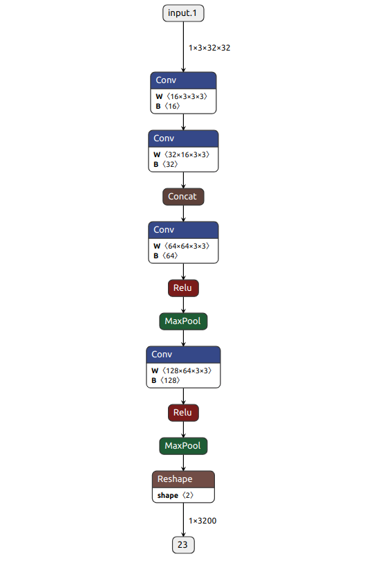

## Introduction

In this project, I give a short overview of the different options you have for exporting and running a deep learning model — beyond just saving a checkpoint. I focus on the different ways you can bring a model into C++, whether you want to run it as-is or optimize it for better performance. This isn’t a deep dive into how CUDA works, but more of a guide to help you understand the different formats and workflows you can use to get your model running in production.

## 0. Introduction and General Rules

Before diving into TensorRT conversion, it’s important to understand a few **general rules** that always apply when converting a PyTorch model to a TensorRT engine, **regardless of the specific conversion method** you choose:

- The model must operate on **a single device** (typically a single GPU).
-  All data passed through the model must be **PyTorch tensors** — no NumPy arrays or other formats.
-  All functions inside the model must be **PyTorch operations** — external functions (like OpenCV operations) are not supported inside the model graph.

In this article, we will use a simple example called **CombinedNet**, which consists of several sub-networks and a decision gate:

```
class Concat(nn.Module):
    def __init__(self):
        super(Concat, self).__init__()

    def forward(self, inputs):
        return torch.cat(inputs, 1)

class Net(nn.Module):
    def __init__(self):
        super(Net, self).__init__()
        self.conv1 = nn.Conv2d(3, 16, 3, 1)
        self.conv2 = nn.Conv2d(16, 32, 3, 1)

    def forward(self, x):
        y = self.conv2(self.conv1(x))
        z = self.conv2(self.conv1(x))
        return y, z

class CombinedNet(nn.Module):
    def __init__(self, num_classes=10):
        super(CombinedNet, self).__init__()
        self.net = Net()
        self.concat = Concat()
        # Additional convolutional layers
        self.conv3 = nn.Conv2d(64, 64, 3, 1)  # 64 channels as input because of concatenation
        self.conv4 = nn.Conv2d(64, 128, 3, 1)
        # Maxpool
        self.maxpool = nn.MaxPool2d(kernel_size=2)

    def forward(self, x):
        y, z = self.net(x)
        x = self.concat((y, z))
        # Additional convolutions with ReLU and maxpool
        x = F.relu(self.conv3(x))
        x = self.maxpool(x)
        x = F.relu(self.conv4(x))
        x = self.maxpool(x)
        # Flatten and pass through the dense layer
        x = x.view(x.size(0), -1)
        if x.mean() > 0:
            decision = x
        else:
            decision = -x
        return decision

```

## 1. Scripting & Tracing 

### 1.1 **General Idea**

Understanding **tracing** and **scripting** is essential, regardless of which model-to-engine conversion method you choose.  
There are two main ways to make a PyTorch model runnable in C++ — without yet quantizing or optimizing it for hardware — using **`torch.jit.script`** or **`torch.jit.trace`**.

From the [official documentation](https://pytorch.org/docs/master/jit.html): 
>TorchScript is a way to create serializable and optimizable models from PyTorch code. Any TorchScript program can be saved from a Python process and loaded in a process where there is no Python dependency.
It is important to understand, that TorchScript is a general module that is used for both tracing **and** scripting.

### 1.2 **TorchScript Tracing**:

- **What it does**:  
    Tracing takes a model and a sample input, runs the input through the model, and **records the sequence of operations** into a computation graph.  
    The resulting model becomes **Python-independent**, just like with scripting, but the graph will only contain the operations that were actually executed during tracing.

- **Method-specific problems**:
    - **No support for control flow**: If the model contains logical branches (e.g., `if` statements), tracing will not capture the logic correctly — you will receive a warning, and the traced model may behave incorrectly.
    - **Captures variables as constants**: Some runtime variables are recorded as fixed constants, which can make the model inflexible.
    - **Captures the device**: If the model was traced on a CPU, the traced model will expect CPU tensors unless manually handled.
    - **Limited support for some PyTorch functions**: Certain PyTorch operations (especially those involving Python-side logic) may not be properly traced.

- **Code example**:  
    To trace a model, you need to create a dummy input and run it through the model during tracing. Here’s a simple example:

    ```
    def transform_model_to_torch_traced(model, traced_filename="combined_net_traced.pt"):
        """
        Transforms a PyTorch model to Torch Traced model and saves it to a file.
    
        Args:
        model (torch.nn.Module): The PyTorch model to be traced.
        traced_filename (str, optional): The filename to save the traced model. Defaults to 'simple_net_traced.pt'.
    
        """
        model.eval()
        example_inputs = torch.rand(1, 3, 32, 32)
    
        # Trace the model with an example input
        traced_model = torch.jit.trace(model, example_inputs)
    
        # Save the traced model to a file
        torch.jit.save(traced_model, traced_filename)
    
        
    if __name__ == '__main__':
        CombinedModel = CombinedNet()
        transform_model_to_torch_traced(CombinedModel)
    ```

For the more complicated case, the model WILL comply, but you will get a warning:
   ```
    TracerWarning: Converting a tensor to a Python boolean might cause the trace to be incorrect. We can't record the data flow of Python values, so this value will be treated as a constant in the future. This means that the trace might not generalize to other inputs!
      if x.mean() > 0:
   ```
  

### 1.3 **TorchScript Scripting**:

- **What it does**:  
    Scripting takes a PyTorch model and **converts it into a lower-level representation** that can run outside of Python.  
    It removes Python-specific overhead, improves memory usage, and enables Just-In-Time (JIT) compilation techniques for faster execution.

- **Method-specific problems**:
    - **Limited support for native Python functions**: Many standard Python operations are not allowed.
    - **Limited support for some PyTorch functions**: Certain dynamic behaviors may not script properly.
    - **No global variables**: All variables must be local or class attributes.
    - **Requires type hints**: Without explicit typing, TorchScript assumes everything is a `Tensor`.
    - **Static typing enforced**: Variable types must remain consistent and cannot change dynamically.
    - **Custom functions must also be scripted**: Any sub-function used in the model needs to be separately scripted or annotated.

- **Code example**:  
    Saving a model as a scripted module is very simple. For a basic module, the process looks like this:
  
  ```
  def transform_model_to_torch_script(model, script_filename="simple_net_scripted.pt"):
        # Script the model with torch.jit.script
        scripted_model = torch.jit.script(model)
    
        # Save the scripted model to a file
        torch.jit.save(scripted_model, script_filename)
  
  if __name__ == '__main__':
    SimpleModel = models.resnet18(pretrained=True)
    transform_model_to_torch_script(SimpleModel)
  ```
  
  Or you can just put a *@torch.jit.script* in from of a nn.Module or a function:
  
  ```
   @torch.jit.script
   def simple_function(x, y):
    print('Simple function')
    r = x + y
    return r
  ```

Now, let's try to script a more complicated model *CombinedModel*. The script will output an error:

```
RuntimeError: 
Arguments for call are not valid.
The following variants are available:
  
  aten::cat(Tensor[] tensors, int dim=0) -> Tensor:
  Expected a value of type 'List[Tensor]' for argument 'tensors' but instead found type 'Tensor (inferred)'.
  Inferred the value for argument 'tensors' to be of type 'Tensor' because it was not annotated with an explicit type.
  
  aten::cat.names(Tensor[] tensors, str dim) -> Tensor:
  Expected a value of type 'List[Tensor]' for argument 'tensors' but instead found type 'Tensor (inferred)'.
  Inferred the value for argument 'tensors' to be of type 'Tensor' because it was not annotated with an explicit type.
  
  aten::cat.names_out(Tensor[] tensors, str dim, *, Tensor(a!) out) -> Tensor(a!):
  Expected a value of type 'List[Tensor]' for argument 'tensors' but instead found type 'Tensor (inferred)'.
  Inferred the value for argument 'tensors' to be of type 'Tensor' because it was not annotated with an explicit type.
  
  aten::cat.out(Tensor[] tensors, int dim=0, *, Tensor(a!) out) -> Tensor(a!):
  Expected a value of type 'List[Tensor]' for argument 'tensors' but instead found type 'Tensor (inferred)'.
  Inferred the value for argument 'tensors' to be of type 'Tensor' because it was not annotated with an explicit type.

The original call is:
  File "/home/anna/Desktop/projects/quantization/example.py", line 15
    def forward(self, inputs):
        # Concatenate along the channel dimension
        return torch.cat(inputs, 1)
               ~~~~~~~~~ <--- HERE
```
This error is quite common. As was said before, it is important to always have *type hints* while scripting a model, because torch.script automatically assumes everything to be a tensor. A simple fix is provided below:

```
from typing import Tuple
class Concat(nn.Module):
    def __init__(self):
        super(Concat, self).__init__()

    def forward(self, inputs: Tuple[torch.Tensor, torch.Tensor]):
        return torch.cat(inputs, 1)

class Net(nn.Module):
    def __init__(self):
        super(Net, self).__init__()
        self.conv1 = nn.Conv2d(3, 16, 3, 1)
        self.conv2 = nn.Conv2d(16, 32, 3, 1)

    def forward(self, x):
        y = self.conv2(self.conv1(x))
        z = self.conv2(self.conv1(x))
        return y, z

class CombinedNet(nn.Module):
    def __init__(self, num_classes=10):
        super(CombinedNet, self).__init__()
        self.net = Net()
        self.concat = Concat()
        # Additional convolutional layers
        self.conv3 = nn.Conv2d(64, 64, 3, 1)  # 64 channels as input because of concatenation
        self.conv4 = nn.Conv2d(64, 128, 3, 1)
        # Maxpool
        self.maxpool = nn.MaxPool2d(kernel_size=2)

    def forward(self, x):
        y, z = self.net(x)
        x = self.concat((y, z))
        # Additional convolutions with ReLU and maxpool
        x = F.relu(self.conv3(x))
        x = self.maxpool(x)
        x = F.relu(self.conv4(x))
        x = self.maxpool(x)
        # Flatten and pass through the dense layer
        x = x.view(x.size(0), -1)
        if x.mean() > 0:
            decision = x
        else:
            decision = -x
        return decision
```
Now the script with compile without erros. 

### 1.4 **Mixing scripting and tracing**:

Luckily, you don't have to stick to just one method.  
You have two options: either **mostly use scripting and trace specific parts** of the model, or **mostly use tracing and script certain blocks** that require it.

There are several helpful sources discussing when to prefer tracing or scripting — but unfortunately, they don't always fully agree.  

For example:
- [This blog post](https://paulbridger.com/posts/mastering-torchscript/) recommends using **scripting as the default** because it is **more beginner-friendly** and **produces easier-to-understand error messages**.
- In contrast, [this blog post](https://ppwwyyxx.com/blog/2022/TorchScript-Tracing-vs-Scripting/) argues that **tracing should be the default**, because scripting demands **overly strict and simple code**, which can **hurt code quality**.

Both blog posts are highly informative and complement each other well, especially when it comes to detailing the kinds of errors users may encounter during tracing or scripting and how to fix them.  
I highly recommend reading both to better understand the trade-offs involved.

```
@torch.jit.script
def decision_gate(x):
    # Custom decision gate based on input
    if x.mean() > 0:
        decision = x
    else:
        decision = -x
    return decision
    
class Concat(nn.Module):
    def __init__(self):
        super(Concat, self).__init__()

    def forward(self, inputs: Tuple[torch.Tensor, torch.Tensor]):
        # Concatenate along the channel dimension
        return torch.cat(inputs, 1)

class Net(nn.Module):
    def __init__(self):
        super(Net, self).__init__()
        self.conv1 = nn.Conv2d(3, 16, 3, 1)
        self.conv2 = nn.Conv2d(16, 32, 3, 1)

    def forward(self, x):
        y = self.conv2(self.conv1(x))
        z = self.conv2(self.conv1(x))
        return y, z

class CombinedNet(nn.Module):
    def __init__(self):
        super(CombinedNet, self).__init__()
        self.net = Net()
        self.concat = Concat()
        # Additional convolutional layers
        self.conv3 = nn.Conv2d(64, 64, 3, 1)  # 64 channels as input because of concatenation
        self.conv4 = nn.Conv2d(64, 128, 3, 1)
        # Maxpool
        self.maxpool = nn.MaxPool2d(kernel_size=2)

    def forward(self, x):
        y, z = self.net(x)
        x = self.concat((y, z))
        # Additional convolutions with ReLU and maxpool
        x = F.relu(self.conv3(x))
        x = self.maxpool(x)
        x = F.relu(self.conv4(x))
        x = self.maxpool(x)
        # Flatten and pass through the dense layer
        x = x.view(x.size(0), -1)
        decision = decision_gate(x)
        return decision
    
if __name__ == '__main__':
    CombinedModel = CombinedNet()
    transform_model_to_torch_traced(CombinedModel)
```
After this change, the script will compile without any warnings. 

## 2. ONNX


### 2.1 **What is an ONNX Model?**

ONNX (Open Neural Network Exchange) is a **standardized, serialized format** for representing deep learning models.  
It allows models to be **saved in a platform-independent format** containing: the model architecture, layer configurations, and learned parameters.

ONNX is supported by a wide ecosystem of tools and libraries, enabling models to be used across different deep learning frameworks (like PyTorch, TensorFlow, and others) and deployed efficiently on various hardware platforms.

In practice, there are two major options when using an ONNX file:
- **ONNX Runtime**: Executes the ONNX model without additional hardware-specific optimizations.
- **TensorRT**: Converts the ONNX model and applies **GPU-specific optimizations** for maximum inference speed.

Thus, ONNX serves as a **bridge** between model training in PyTorch and optimized inference using TensorRT.
### 2.2 **How Does the `torch.onnx.export` Function Work?**

When you export a model to ONNX from PyTorch, the process involves several key steps:

1.Model Tracing. The first step is **tracing the model** with example input data. This runs the model once with sample inputs and **captures the sequence of operations** executed. Tracing is crucial to recording the model's computational graph and the flow of data.
_(Note: If the model is already scripted with TorchScript, it can skip dynamic tracing.)_

2.Node Creation. As the model is traced: Each operation (e.g., convolution, activation, batch normalization) is recorded as a **node** in the ONNX graph. The graph stores the **data types** and **shapes** of all intermediate tensors. Inputs and outputs of the model are clearly defined.

3.Serialization. The ONNX graph, including: node structures, tensor shapes, types, and all learnable parameters, is **serialized** into an efficient storage format (binary or text-based).
This serialization allows the model to be easily stored, transferred, and loaded by any ONNX-compatible runtime.

4.Export to File. Finally, the entire graph is **saved to a `.onnx` file**, which can then be used for inference or further optimization.

### 2.3 A few important technical notes:

Internally, `torch.onnx.export` can use **either tracing or scripting**, depending on the model type and settings.  It can take as input either a **regular PyTorch model** or a **saved `.pt` TorchScript model**. The [official documentation](https://pytorch.org/docs/master/onnx.html) describes these options in detail:

>Internally, torch.onnx.export() requires a torch.jit.ScriptModule rather than a torch.nn.Module. If the passed-in model is not already a ScriptModule, export() will use tracing to convert it to one:
>>**Tracing**: If torch.onnx.export() is called with a Module that is not already a ScriptModule, it first does the equivalent of torch.jit.trace(), which executes the model once with the given args and records all operations that happen during that execution. This means that if your model is dynamic, e.g., changes behavior depending on input data, the exported model will not capture this dynamic behavior. We recommend examining the exported model and making sure the operators look reasonable. Tracing will unroll loops and if statements, exporting a static graph that is exactly the same as the traced run. If you want to export your model with dynamic control flow, you will need to use scripting.
>>**Scripting**: Compiling a model via scripting preserves dynamic control flow and is valid for inputs of different sizes. To use scripting:
Use torch.jit.script() to produce a ScriptModule.
Call torch.onnx.export() with the ScriptModule as the model. The args are still required, but they will be used internally only to produce example outputs, so that the types and shapes of the outputs can be captured. No tracing will be performed.

### 2.3 **The limitations of ONNX**

- Complex Control Flows
During ONNX export, the model is traced by running a **dummy input** through it.  
As a result, any **control flow** (such as `if` conditions or loops that depend on inputs) will be **frozen** into a single execution path based on the dummy input.  
If one branch of logic is chosen during tracing, that branch becomes **fixed** — and the resulting ONNX model will always follow that path, regardless of future inputs.  
This means that while the model will successfully export and the `.onnx` file will be created, **it might not behave correctly** during real inference.

 - PyTorch Function Support
Not all PyTorch operations are supported in the ONNX format.  
If an unsupported function is encountered during export, an error or warning may appear.  
In most cases, the issue can be solved by **rewriting the problematic function manually** using only operations that ONNX supports.

### 2.4 **Code example**

The code to convert the model to onnx is quite simple:
```
import torch
import torchvision.models as models
import torch.onnx as onnx

def transform_model_to_onnx(model, onnx_filename):
    # Create a pre-trained PyTorch model
    model.eval()

    # Create example input data
    input_data = torch.randn(1, 3, 224, 224)

    # Export the model to ONNX format
    torch.onnx.export(model, input_data, onnx_filename, verbose=True, opset_version=11)

if __name__ == '__main__':
    CombinedModel = CombinedNet()
    transform_model_to_onnx(CombinedModel, onnx_filename="combined_model.onnx")
```

The output will give the same warning, as the tracing function, as tracing is at the backgroung of .onnx transform:
```
TracerWarning: Converting a tensor to a Python boolean might cause the trace to be incorrect. We can't record the data flow of Python values, so this value will be treated as a constant in the future. This means that the trace might not generalize to other inputs!
  if x.mean() > 0:
```

But in addition to that, the exported graph will be written out in the console: 
```
Exported graph: graph(%input.1 : Float(1, 3, 224, 224, strides=[150528, 50176, 224, 1], requires_grad=0, device=cpu),
      %net.conv1.weight : Float(16, 3, 3, 3, strides=[27, 9, 3, 1], requires_grad=1, device=cpu),
      %net.conv1.bias : Float(16, strides=[1], requires_grad=1, device=cpu),
      %net.conv2.weight : Float(32, 16, 3, 3, strides=[144, 9, 3, 1], requires_grad=1, device=cpu),
      %net.conv2.bias : Float(32, strides=[1], requires_grad=1, device=cpu)):
  %/net/conv1/Conv_output_0 : Float(1, 16, 222, 222, strides=[788544, 49284, 222, 1], requires_grad=0, device=cpu) = onnx::Conv[dilations=[1, 1], group=1, kernel_shape=[3, 3], pads=[0, 0, 0, 0], strides=[1, 1], onnx_name="/net/conv1/Conv"](%input.1, %net.conv1.weight, %net.conv1.bias), scope: __main__.CombinedNet::/__main__.Net::net/torch.nn.modules.conv.Conv2d::conv1 # /home/anna/anaconda3/envs/tensorrt/lib/python3.9/site-packages/torch/nn/modules/conv.py:456:0
  %/net/conv2/Conv_output_0 : Float(1, 32, 220, 220, strides=[1548800, 48400, 220, 1], requires_grad=0, device=cpu) = onnx::Conv[dilations=[1, 1], group=1, kernel_shape=[3, 3], pads=[0, 0, 0, 0], strides=[1, 1], onnx_name="/net/conv2/Conv"](%/net/conv1/Conv_output_0, %net.conv2.weight, %net.conv2.bias), scope: __main__.CombinedNet::/__main__.Net::net/torch.nn.modules.conv.Conv2d::conv2 # /home/anna/anaconda3/envs/tensorrt/lib/python3.9/site-packages/torch/nn/modules/conv.py:456:0
  %/concat/Concat_output_0 : Float(1, 64, 220, 220, strides=[3097600, 48400, 220, 1], requires_grad=1, device=cpu) = onnx::Concat[axis=1, onnx_name="/concat/Concat"](%/net/conv2/Conv_output_0, %/net/conv2/Conv_output_0), scope: __main__.CombinedNet::/__main__.Concat::concat # /home/anna/Desktop/projects/quantization/example.py:15:0
  %8 : Float(1, 64, 220, 220, strides=[3097600, 48400, 220, 1], requires_grad=1, device=cpu) = onnx::Neg[onnx_name="/Neg"](%/concat/Concat_output_0), scope: __main__.CombinedNet:: # /home/anna/Desktop/projects/quantization/example.py:41:0
  return (%8)
```

Then we can go to the Netron site, load the onnx model and get the following graph: 


----

### 2.5 ONNX-Runtime 


ONNX Runtime is a highly flexible and universal inference engine that supports multiple languages, including Python, C++, C#, and Java, and can run models across CPUs, GPUs, mobile devices, and even browsers.  
You would typically choose ONNX Runtime over TensorRT when you need broad hardware and platform compatibility, such as deploying models on CPUs, mobile devices, or cloud servers.  
ONNX Runtime is easier to set up compared to TensorRT, supports multiple programming languages, and can even integrate TensorRT internally if GPU-specific acceleration is available.
```
import onnxruntime as ort
import numpy as np

def run_onnx_inference(model_path, input_array, use_gpu=False):
    # Choose provider: CPU or GPU
    providers = ['CUDAExecutionProvider'] if use_gpu else ['CPUExecutionProvider']
    
    # Load the model
    session = ort.InferenceSession(model_path, providers=providers)

    # Get input name
    input_name = session.get_inputs()[0].name

    # Run inference
    outputs = session.run(None, {input_name: input_array})

    return outputs[0]

# Example usage:
if __name__ == "__main__":
    # Load or create input
    dummy_input = np.random.rand(1, 3, 224, 224).astype(np.float32)  # Example shape

    # Run inference
    output = run_onnx_inference('model.onnx', dummy_input, use_gpu=False)

    print("Output:", output)

```
## 3. TensorRT

#### 3.1 General information about TensorRT

What is TensorRT? First_lets compare with how PyTorch runs the model. In usual PyTorch inference, the model runs in dynamic eager execution, meaning Python interprets and executes operations one-by-one at runtime. Each layer is processed separately, causing frequent memory reads and writes between layers.
Now we know that ONNX is faster because it runs a static, precompiled computation graph in optimized C++ without Python overhead. 
TensorRT goes even further by not just running a static graph, but also fusing layers, reducing precision (FP16/INT8), tuning kernels for your GPU, and deeply optimizing memory, making it 2× to 10× faster than PyTorch. Let's about it in more detail:

- Running a Static Graph
Like ONNX Runtime, TensorRT **does not dynamically interpret** operations at runtime. It **preplans the full computation graph** and executes it directly.

- Layer Fusion
TensorRT **analyzes** the computation graph and **merges multiple small operations** into one. For example instead of separately running convolution → batch norm → activation → pooling, it fuses them into **one big GPU kernel**.

- Precision Reduction (FP16 / INT8)
TensorRT can convert operations from 32-bit (FP32) numerical precision to 16-bit floats (FP16), 8-bit floats (FP8)(in latest TensorRT versions) or 8-bit integers (INT8).

- Kernel Auto-Tuning for Your GPU
TensorRT **benchmarks many implementation options** (kernel types, thread/block sizes) for each operation.It **chooses the fastest strategy** for your exact GPU hardware.

Due to the last point, we can see why every TensorRT engine is specific to each architecture! In other words, when you create a engine on your laptop or PC, it will be tuned to your laptop's specific GPU characteristics and will not work on another device. You will have to create it again. 

Important note: sometimes you see **.trt** files and sometimes **.engine** files. Both are TensorRT serialized engines.

- **.engine** is the standard TensorRT engine file (default).
    
- **.trt** is just an alternative extension some users or projects use — **no technical difference** unless the project specifically expects one or the other.

#### 3.2 Which problems can arise while converting the model from .onnx format to .trt

1.**Unsupported Operations**
TensorRT doesn't support every ONNX operator. If your model has exotic ops (like fancy custom layers), TensorRT might fail to parse the ONNX model.
 Fix:
    - Simplify the model beforehand.
    - Or write a custom TensorRT plugin to handle the missing op.

2.**Dynamic Shapes Problems and Control Flow**
TensorRT is very good with static shapes. If your ONNX model has dynamic input sizes (e.g., variable image sizes), you have to explicitly set optimization profiles.  Otherwise, the engine might fail to build or crash at runtime.
 Fix:
    - If you export the .onnx graph with tracing in the backend(which is a default option anyway), the dynamic shape errors(or control flow) will appear at that stage and will be easier to deal with, as TensorRT can be harder to debug. 

3.**Precision Issues (FP16/INT8 Calibration)**
If you convert to FP16 or INT8, some layers might lose too much numerical precision. This can cause accuracy drops or instability.
Fix:
    - Fine-tune precision settings (keep critical layers in FP32).
    - Use proper calibration datasets for INT8.

 4.**Large Model Size**
Very large models can fail to convert because:  GPU memory isn't enough during engine building or TensorRT hit some internal limits (e.g., max tensor size).
Fix:
    - Use smaller batch sizes.
    - Try network partitioning if possible.

5.**Version Mismatch**
ONNX versions and TensorRT versions have to be compatible. A model exported with a newer ONNX version might not be fully supported by your TensorRT version.
-**Fix**:
    - Match the ONNX opset argument when exporting.
    - Upgrade TensorRT if needed.  

#### 3.2 Installing TensorRT

In my experience, one of the most complicated things about TensorRT is installing it. There are several ways to do it: install it from tensorrt website or get it thought docker(if you are familiar with docker). For the first option go to the [official documentation](https://docs.nvidia.com/deeplearning/tensorrt/archives/tensorrt-1010/install-guide/index.html). In most cases, it is recommened to install TensorRT from a TAR file, as it is simpler. 
If you are familiar with Docker, those are the steps to run TensorRT in it(assuming that you already have docker installed):

1.You **must** install this so Docker containers can talk to your GPU:

```
# Install dependencies
sudo apt-get install -y nvidia-driver-525 # or your latest driver

# Install nvidia-docker2

distribution=$(. /etc/os-release;echo $ID$VERSION_ID)
curl -s -L https://nvidia.github.io/nvidia-docker/gpgkey | sudo apt-key add -
curl -s -L https://nvidia.github.io/nvidia-docker/$distribution/nvidia-docker.list | sudo tee /etc/apt/sources.list.d/nvidia-docker.list

sudo apt-get update

# Install the toolkit
sudo apt-get install -y nvidia-docker2

# Restart Docker service
sudo systemctl restart docker
```

After that, check:
```
docker run --gpus all nvidia/cuda:12.2.0-base-ubuntu22.04 nvidia-smi
```

You should see your GPU detected **inside Docker**!

2.Pull a TensorRT Docker image

NVIDIA already publishes ready TensorRT images.
For example:
`docker pull nvcr.io/nvidia/tensorrt:23.12-py3`
`docker pull nvcr.io/nvidia/tensorrt:24.02-py3`

These images come with:
- TensorRT
- CUDA
- cuDNN
- Python bindings

Before choosing which container version to choose, check the [release notes](https://docs.nvidia.com/deeplearning/frameworks/container-release-notes/index.html) to make sure it matches your needs. 

 3.After that you can run the container: 
```
docker run --gpus all -it --rm nvcr.io/nvidia/tensorrt:24.02-py3
```

### 3.3 Getting started with TensorRT:

**3.3.1 Creating an engine**

There is a great tool that can help start with TensorRT - `trtexec`! It runs from the command line and only needs an .onnx file. It also comes as a part of a TensorRT package by default, so you dont have to additionally install anything!

You can do two things with `trtexect`:
- Create a serilized engine from an onnx file.
- Run that engine with random input and benchmark the results.

The simplest command with `trtexec`:
```
trtexec --onnx=model.onnx --saveEngine=model.engine
```

This will take the model.onnx file and created a serialized enigne model.engine from it. 
But it is preferable to use it with a few additional arguments:

```
trtexec \
  --onnx=/path/to/your_model.onnx \
  --saveEngine=/path/to/your_model_fp16.engine \
  --fp16 \
  --workspace=4096 \
  --minShapes=input:1x3x224x224 \
  --optShapes=input:8x3x224x224 \
  --maxShapes=input:16x3x224x224 \
  --explicitBatch
```

| Option                       | Meaning |
|:------------------------------|:--------|
| `--onnx`                      | Path to your ONNX model |
| `--saveEngine`                | Path to save the output `.engine` file |
| `--fp16`                      | Enable FP16 precision (if hardware supports) |
| `--workspace=4096`            | Workspace memory in MB (larger is better for performance tuning) |
| `--minShapes`, `--optShapes`, `--maxShapes` | Set minimum, optimal, and maximum input shapes (for dynamic batch sizes) |
| `--explicitBatch`             | Required for dynamic shapes (ONNX models usually use explicit batch) |

If you want to have a but more control over the model export process, you can use python api:
```
import os
import sys
import logging
import argparse
import tensorrt as trt

logging.basicConfig(level=logging.INFO)
logger = logging.getLogger("TRTEngineCreator")


class TRTEngineCreator:
    def __init__(self, verbose=False, workspace_gb=16):
        """
        Initialize TensorRT builder, logger, and configuration.
        """
        self.logger = trt.Logger(trt.Logger.VERBOSE if verbose else trt.Logger.INFO)
        trt.init_libnvinfer_plugins(self.logger, namespace="")

        self.builder = trt.Builder(self.logger)
        self.config = self.builder.create_builder_config()
        self.config.set_memory_pool_limit(trt.MemoryPoolType.WORKSPACE, workspace_gb * (1 << 30))

        self.network = None
        self.parser = None

    def parse_onnx_model(self, onnx_file_path):
        """
        Load and parse the ONNX file to create a TensorRT network.
        """
        onnx_file_path = os.path.realpath(onnx_file_path)
        self.network = self.builder.create_network(1)
        self.parser = trt.OnnxParser(self.network, self.logger)

        with open(onnx_file_path, 'rb') as model_file:
            if not self.parser.parse(model_file.read()):
                logger.error(f"Failed to parse ONNX model: {onnx_file_path}")
                for idx in range(self.parser.num_errors):
                    logger.error(self.parser.get_error(idx))
                sys.exit(1)

        self._print_network_info()

    def _print_network_info(self):
        logger.info("Model Inputs:")
        for i in range(self.network.num_inputs):
            input_tensor = self.network.get_input(i)
            logger.info(f"  {input_tensor.name}: shape={input_tensor.shape}, dtype={input_tensor.dtype}")

        logger.info("Model Outputs:")
        for i in range(self.network.num_outputs):
            output_tensor = self.network.get_output(i)
            logger.info(f"  {output_tensor.name}: shape={output_tensor.shape}, dtype={output_tensor.dtype}")

    def build_and_serialize(self, output_engine_path, precision_mode='fp16', enable_int8=False):
        """
        Build and save the TensorRT engine.
        """
        output_engine_path = os.path.realpath(output_engine_path)
        os.makedirs(os.path.dirname(output_engine_path), exist_ok=True)

        # Set precision configurations
        if precision_mode == 'fp16':
            if not self.builder.platform_has_fast_fp16:
                logger.warning("Native FP16 support not detected.")
            self.config.set_flag(trt.BuilderFlag.FP16)
        elif precision_mode == 'fp8':
            if not self.builder.platform_has_fast_fp8:
                logger.warning("Native FP8 support not detected.")
            self.config.set_flag(trt.BuilderFlag.FP8)

        if enable_int8:
            if not self.builder.platform_has_fast_int8:
                logger.warning("Native INT8 support not detected.")
            else:
                self.config.set_flag(trt.BuilderFlag.INT8)

        logger.info(f"Starting engine build with precision={precision_mode}, INT8={enable_int8}")

        serialized_engine = self.builder.build_serialized_network(self.network, self.config)
        if serialized_engine is None:
            logger.error("TensorRT engine creation failed.")
            sys.exit(1)

        with open(output_engine_path, 'wb') as f:
            f.write(serialized_engine)
            logger.info(f"Engine successfully saved to: {output_engine_path}")


def get_arguments():
    parser = argparse.ArgumentParser(description="TensorRT Engine Builder from ONNX models.")
    parser.add_argument("-m", "--model", required=True, help="Path to the ONNX model.")
    parser.add_argument("-o", "--output", required=True, help="Destination path for TensorRT engine.")
    parser.add_argument("-p", "--precision", choices=["fp32", "fp16", "fp8"], default="fp32", help="Precision mode to use.")
    parser.add_argument("--int8", action="store_true", help="Enable INT8 precision optimization.")
    parser.add_argument("-v", "--verbose", action="store_true", help="Enable detailed logs.")
    parser.add_argument("-w", "--workspace", type=int, default=16, help="Workspace memory size in GB (default 16).")
    return parser.parse_args()


def run():
    args = get_arguments()
    engine_creator = TRTEngineCreator(verbose=args.verbose, workspace_gb=args.workspace)
    engine_creator.parse_onnx_model(args.model)
    engine_creator.build_and_serialize(args.output, precision_mode=args.precision, enable_int8=args.int8)


if __name__ == "__main__":
    run()
```

Lets take a look at all the components which TensorRT uses in order to create an engine and how do they relate to one another:

| Step | What happens | Example function |
|:-----|:-------------|:-----------------|
| 1. Create a Logger | TensorRT needs a logger to output warnings, errors, info. | `trt.Logger(trt.Logger.WARNING)` |
| 2. Create a Builder and Config | Builder = builds the engine. <br> Config = sets settings like memory size, precision. | `trt.Builder(trt_logger)` <br> `builder.create_builder_config()` |
| 3. Create a Network and Parser | Network = holds the model structure. <br> Parser = reads the ONNX model into the network. | `builder.create_network(1)` <br> `trt.OnnxParser(network, logger)` |
| 4. Parse the ONNX Model | Open your `.onnx` file and parse it into TensorRT's internal network format. | `parser.parse(f.read())` |
| 5. Build and Serialize the Engine | Optimize and save the model as a `.engine` file. | `builder.build_serialized_network(network, config)` |

**3.3.2 Running the engine**

In order to run the model with a custom input, `TensorRTInference` class can be created. It loads a TensorRT `.engine` file, allocates GPU memory for inputs and outputs, and runs inference on the GPU to produce predictions.

```
import tensorrt as trt
import pycuda.driver as cuda
import pycuda.autoinit
import numpy as np

class TensorRTInference:
    def __init__(self, engine_path):
        self.engine_path = engine_path
        self.engine = self.load_engine()
        self.context = self.engine.create_execution_context()
        self.inputs = []
        self.outputs = []
        self.bindings = []
        self.stream = cuda.Stream()
        self._allocate_memory()

    def load_engine(self):
        TRT_LOGGER = trt.Logger(trt.Logger.WARNING)
        with open(self.engine_path, 'rb') as f, trt.Runtime(TRT_LOGGER) as runtime:
            return runtime.deserialize_cuda_engine(f.read())

    def _allocate_memory(self):
        for binding in self.engine:
            shape = self.context.get_binding_shape(binding)
            size = trt.volume(shape)
            dtype = trt.nptype(self.engine.get_binding_dtype(binding))
            host_mem = cuda.pagelocked_empty(size, dtype)
            device_mem = cuda.mem_alloc(host_mem.nbytes)
            self.bindings.append(int(device_mem))
            if self.engine.binding_is_input(binding):
                self.inputs.append((host_mem, device_mem))
            else:
                self.outputs.append((host_mem, device_mem))

    def infer(self, input_array):
        np.copyto(self.inputs[0][0], input_array.ravel())
        cuda.memcpy_htod_async(self.inputs[0][1], self.inputs[0][0], self.stream)

        self.context.execute_async_v2(bindings=self.bindings, stream_handle=self.stream.handle)

        cuda.memcpy_dtoh_async(self.outputs[0][0], self.outputs[0][1], self.stream)
        self.stream.synchronize()

        return self.outputs[0][0]

if __name__ == "__main__":
    # Example dummy input (adapt shape to your model)
    input_data = np.random.rand(1, 3, 224, 224).astype(np.float32)

    model = TensorRTInference('model.engine')
    output = model.infer(input_data)

    print("Output:", output)

```

##3 Conclusion

Aside from the methods discussed in this article, there are also a few end-to-end packages that can create a TensorRT engine directly from a checkpoint, without requiring manual tracing, scripting, or ONNX conversion.
I plan to add a section about these packages in the future as I continue working on this guide.

This article is intended as a living document — it will be continuously updated and expanded over time as I explore new tools, workflows, and best practices for model deployment.

Thank you for reading!