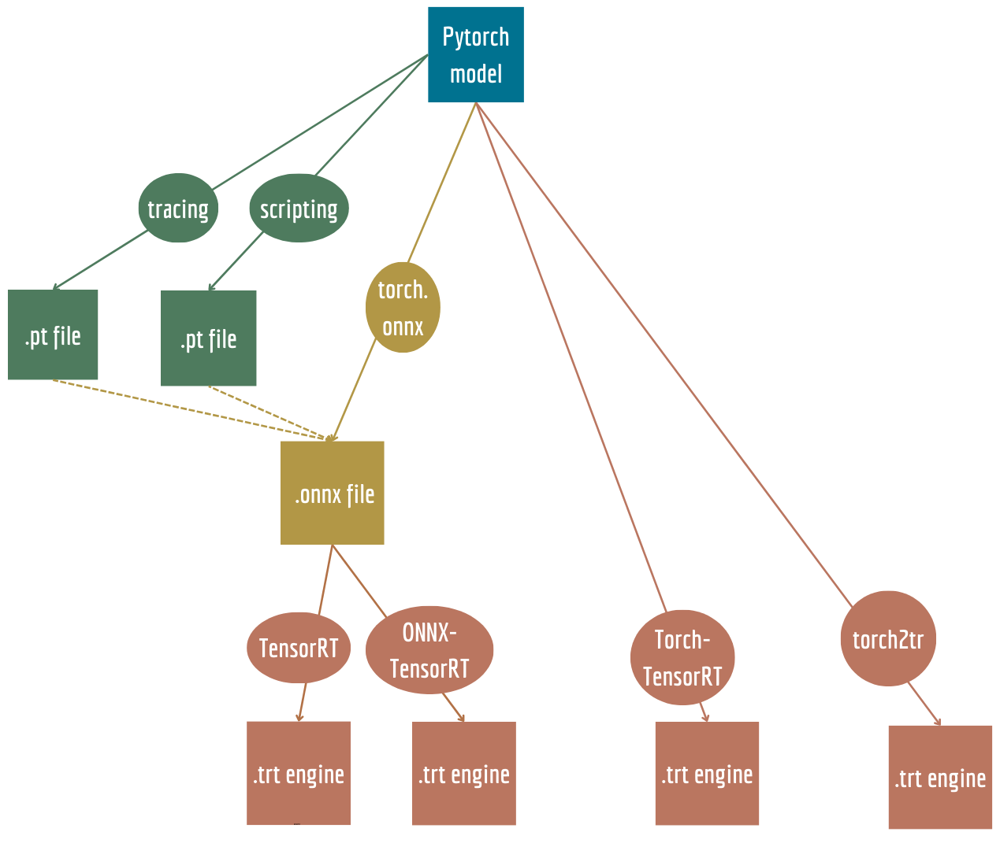

## 0. Intoduction and the general rules 

+ The general rules
Specifically for pytorch-to-engine conversion there are some general rules that do now depend on the method of coversion that you chose:
1. The model has to be single-device
2. All data has to be pytorch tensors, so no numpy array 
3. The functions used indise a model have to be pytorch functions(for example, no OpenCV functions)




## 1. Scripting & Tracing 

- **General idea**
The tracing and scripting modules are important to understand, no matter which method of model-to-engine conversion you will chose. 
There are two ways to converst the pytorch model to the format that will be runnable in cpp, but will not be quantised and optimized for the hardware: torch.jit.script and torch.jit.trace.

From the [official documentation](https://pytorch.org/docs/master/jit.html): 
>TorchScript is a way to create serializable and optimizable models from PyTorch code. Any TorchScript program can be saved from a Python process and loaded in a process where there is no Python dependency.
It is important to understand, that TorchScript is a general module that is used for both tracing **and** scripting.

- **The difference between torch.jit.trace and torch.jit.script**\
In simple terms, `jit.trace` traces the execution of a model with example inputs to create a dynamic computation graph, while `jit.script` converts the model's Python code directly into a static computation graph.
Let's look at the differences between them in more detail:

  - TorchScript:
  
    **What it does**: TorchScript is a way to convert your PyTorch model into a more lightweight and efficient representation that can be run outside of Python.\
    **How it works**: You define your PyTorch model in Python as you normally would. Then, you use the torch.jit.script() function to "compile" your model into a TorchScript module. This process involves analyzing your code and creating an optimized representation of your model.\
    **Use case**: TorchScript is useful when you want to deploy your model in a different environment, such as mobile devices or non-Python applications, while still benefiting from PyTorch's model training and evaluation capabilities.

  - TorchScript Tracing:

    **What it does**: TorchScript tracing is a technique for creating a TorchScript representation of your model by recording the operations that occur during a sample input's forward pass.\
    **How it works**: You provide a sample input to your PyTorch model, and TorchScript records the operations as your input flows through the model. This recorded sequence of operations is then converted into a TorchScript module.\
    **Use case**: TorchScript tracing is useful when you have dynamic control flow or conditional operations in your model that are difficult to capture with standard TorchScript. It's a way to create a TorchScript module from the specific execution path of your model given a particular input.\
    
    In summary, TorchScript is a more general way to compile your PyTorch model into a standalone format, while TorchScript tracing is a specific technique that captures the behavior of your model for a specific input. The choice between them depends on your use case and whether your model has complex control flow or dynamic behavior that requires tracing.


## 2. The pytorch model-ONNX-TensorRT

- **What is ONNX model?**\
ONNX (Open Neural Network Exchange) is a serialized representation of the model, and it can be used with various deep learning frameworks and runtime libraries that support the ONNX standard. ONNX files contain model architectures, layer configurations, and learnable parameters in a platform-independent format. ONNX is supported by a wide ecosystem of tools and libraries, enabling efficient inference on various hardware and platforms. A resulting .onnx file can be used both for using a model in another DL framework and deploying the model in TensorRT.

- **How does the pytorch.onnx function works?**\
The code to transform a PyTorch model to ONNX looks like this:

```
import torch
import torchvision.models as models
import torch.onnx as onnx

def transform_model_to_onnx(model, onnx_filename):
    # Create a pre-trained PyTorch model
    model.eval()

    # Create example input data
    input_data = torch.randn(1, 3, 224, 224)

    # Export the model to ONNX format
    torch.onnx.export(model, input_data, onnx_filename, verbose=True, opset_version=11)

if __name__ == '__main__':
    resnet_model = models.resnet18(pretrained=True)
    resnet_onnx_filename = "resnet18.onnx"
    transform_model_to_onnx(model=resnet_model, onnx_filename=resnet_onnx_filename)
    
```
The code itself is not comlicated, but it is important to understand exactly what is going on here. 
The ONNX graph is created when you export a deep learning model from a framework like PyTorch or TensorFlow. The process involves several steps:\

1. Model Tracing:
The first step in creating an ONNX graph is to trace the model using example input data. This means running the model with sample inputs to capture a sequence of operations.
Tracing is necessary to record the operations and their order as the input data flows through the model. This tracing process is framework-specific and depends on the deep learning framework being used.

2. Node Creation:
As the model is traced, each operation or layer becomes a node in the ONNX graph. These nodes represent the computations performed by the model. For example, a convolutional layer, a batch normalization layer, or an activation function each corresponds to a node in the graph.  The ONNX graph specifies the data types and shapes of tensors at each node. It also includes input and output tensors, which represent the data flowing into and out of the model.

3. Serialization Format:
The entire ONNX graph, including its structure, node attributes, input/output tensors, data types, shapes, and serialized parameters, is saved in a serialized format.
The serialization format can be binary or text-based, but it's designed to be efficient for storage and transmission.
Export to File:

The final step is to save the ONNX graph to a file. 

On the backend, the function torch.onnx uses either **scripting** or **tracing**. Also, it can take both a pytoch model, or a .pt model as input. [The official documentation](https://pytorch.org/docs/master/onnx.html) descibes it the following way:

>Internally, torch.onnx.export() requires a torch.jit.ScriptModule rather than a torch.nn.Module. If the passed-in model is not already a ScriptModule, export() will use tracing to convert it to one:
>>**Tracing**: If torch.onnx.export() is called with a Module that is not already a ScriptModule, it first does the equivalent of torch.jit.trace(), which executes the model once with the given args and records all operations that happen during that execution. This means that if your model is dynamic, e.g., changes behavior depending on input data, the exported model will not capture this dynamic behavior. We recommend examining the exported model and making sure the operators look reasonable. Tracing will unroll loops and if statements, exporting a static graph that is exactly the same as the traced run. If you want to export your model with dynamic control flow, you will need to use scripting.
>>**Scripting**: Compiling a model via scripting preserves dynamic control flow and is valid for inputs of different sizes. To use scripting:
Use torch.jit.script() to produce a ScriptModule.
Call torch.onnx.export() with the ScriptModule as the model. The args are still required, but they will be used internally only to produce example outputs, so that the types and shapes of the outputs can be captured. No tracing will be performed.

- **The limitations of ONNX**
1. Complex Control Flows
During the creation of the .onnx file the model is traced by running the dummy input thorugh it. Because of it, all the logical gates (if oprations, that are dependant on the input to the model, loops) will be frozen. If during the tracing process one option was chosen, it will be the default option in the future. This means, that your model will comply and the .onnx file will be saved, but there is a possibility it will not work as intended.
2. PyTorch function support
Not all PyTorch function are supported in the onnx format. In most cases, the issue can be solved by rewriting the function manually. 
