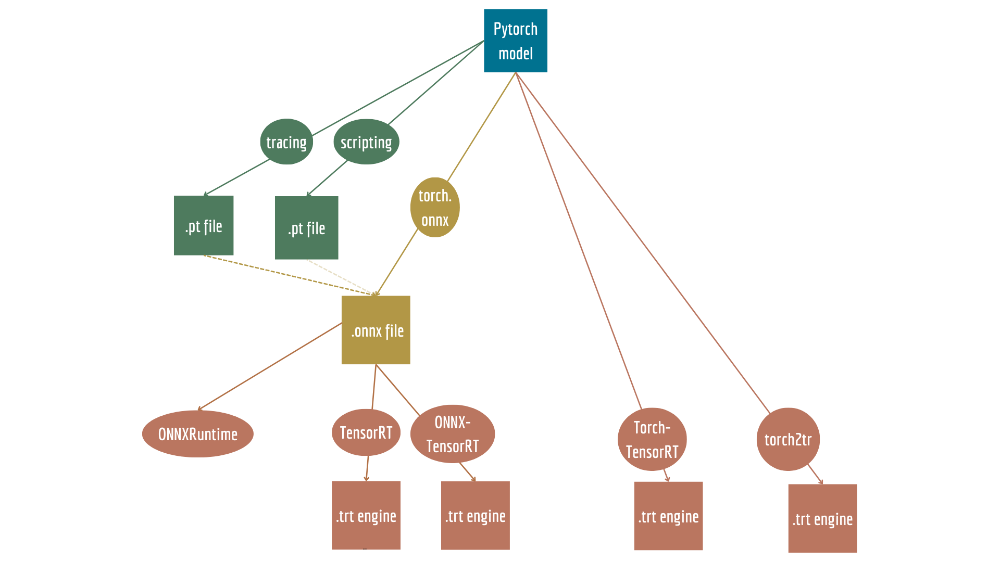

## 0. Intoduction and the general rules 

+ The general rules
Specifically for pytorch-to-engine conversion there are some general rules that do now depend on the method of coversion that you chose:
1. The model has to be single-device
2. All data has to be pytorch tensors, so no numpy array 
3. The functions used indise a model have to be pytorch functions(for example, no OpenCV functions)



We will be working with two newral networks as examples. A very simple network to show the basic functionaly 
```
if __name__ == '__main__':
    SimpleModel = models.resnet18(pretrained=True)
```
And a more complicated newral network, that is combines of several smaller newral networs and also has a more complicated decision gate:

```
class Concat(nn.Module):
    def __init__(self):
        super(Concat, self).__init__()

    def forward(self, inputs: Tuple[torch.Tensor, torch.Tensor]):
        # Concatenate along the channel dimension
        return torch.cat(inputs, 1)

class Net(nn.Module):
    def __init__(self):
        super(Net, self).__init__()
        self.conv1 = nn.Conv2d(3, 16, 3, 1)
        self.conv2 = nn.Conv2d(16, 32, 3, 1)

    def forward(self, x):
        y = self.conv2(self.conv1(x))
        z = self.conv2(self.conv1(x))
        return y, z

class CombinedNet(nn.Module):
    def __init__(self):
        super(CombinedNet, self).__init__()
        self.net = Net()
        self.concat = Concat()

    def forward(self, x):
        y, z = self.net(x)
        x = self.concat((y, z))
                
        if x.mean() > 0:
            decision = x
        else:
            decision = -x
            
        return decision
```

## 1. Scripting & Tracing 

1.1 **General idea**
The tracing and scripting modules are important to understand, no matter which method of model-to-engine conversion you will chose. 
There are two ways to make the pytorch model runnable in cpp, but not be quantised and optimized for the hardware: torch.jit.script and torch.jit.trace.  

From the [official documentation](https://pytorch.org/docs/master/jit.html): 
>TorchScript is a way to create serializable and optimizable models from PyTorch code. Any TorchScript program can be saved from a Python process and loaded in a process where there is no Python dependency.
It is important to understand, that TorchScript is a general module that is used for both tracing **and** scripting.

1.2 **TorchScript Tracing**:

- **What it does**: Tracing takes the model and the input, runs the input throught the model and records the operations into a graph. The resulting model becomes python-independant, just like as in scripting, but the operations will be  \
- **Method specific problems**:
      + Doesn't support control flow, so if you have a logical gate, you will get a warning(the model will compile, but not correctly)
      + Captures some variables as constants
      + Captures device, for example, if we had cpu during tracing, it will be saved as a cpu specific device 
      + Does not support some pytorch functions \
- **Code example**: to trace the model you have to create a dummy input and run it throught the model, let's look at simple example:
    ```
    def transform_model_to_torch_traced(model, traced_filename="simple_net_traced.pt"):
        """
        Transforms a PyTorch model to Torch Traced model and saves it to a file.
    
        Args:
        model (torch.nn.Module): The PyTorch model to be traced.
        traced_filename (str, optional): The filename to save the traced model. Defaults to 'simple_net_traced.pt'.
    
        """
        model.eval()
        example_inputs = torch.rand(1, 3, 32, 32)
    
        # Trace the model with an example input
        traced_model = torch.jit.trace(model, example_inputs)
    
        # Save the traced model to a file
        torch.jit.save(traced_model, traced_filename)
    
        
    if __name__ == '__main__':
        SimpleModel = models.resnet18(pretrained=True)
        transform_model_to_torch_traced(SimpleModel)
    ```
But for the more complicated model, the model WILL comply, but you will get a warning:
   ```
    TracerWarning: Converting a tensor to a Python boolean might cause the trace to be incorrect. We can't record the data flow of Python values, so this value will be treated as a constant in the future. This means that the trace might not generalize to other inputs!
      if x.mean() > 0:
   ```
  

1.3 **TorchScript Scripting**:

- **What it does**: In simple terms, scripting takes the pytorch model and transofms it into a lower level representation that can be used outside of Python. It can remove Python-specific overhead, improve memory usage, and enable the use of Just-In-Time (JIT) compilation techniques for faster execution. \
- **Method specific problems**:
      + Does not support a lot of native python functions
      + Does not support some pytorch functions 
      + Does not allow global variables 
      + Need type hints, otherwise assumes everything to be a PyTorch tensor
      + The types of the variables need to be static 
      + Every custom function inside also needs to be scripted \
- **Code example**:
  A function to save a torch model as scripted module is quite simple. While using a simple module the process is straightforward:
  
  ```
  def transform_model_to_torch_script(model, script_filename="simple_net_scripted.pt"):
        # Script the model with torch.jit.script
        scripted_model = torch.jit.script(model)
    
        # Save the scripted model to a file
        torch.jit.save(scripted_model, script_filename)
  
  if __name__ == '__main__':
    SimpleModel = models.resnet18(pretrained=True)
    transform_model_to_torch_script(SimpleModel)
  ```
  
  Or you can just put a *@torch.jit.script* in from of a nn.Module or a function:
  
  ```
   @torch.jit.script
   def simple_function(x, y):
    print('Simple function')
    r = x + y
    return r
  ```

Now, let's try to script a more complicated model *CombinedModel*. The script will output an error:

```
RuntimeError: 
Arguments for call are not valid.
The following variants are available:
  
  aten::cat(Tensor[] tensors, int dim=0) -> Tensor:
  Expected a value of type 'List[Tensor]' for argument 'tensors' but instead found type 'Tensor (inferred)'.
  Inferred the value for argument 'tensors' to be of type 'Tensor' because it was not annotated with an explicit type.
  
  aten::cat.names(Tensor[] tensors, str dim) -> Tensor:
  Expected a value of type 'List[Tensor]' for argument 'tensors' but instead found type 'Tensor (inferred)'.
  Inferred the value for argument 'tensors' to be of type 'Tensor' because it was not annotated with an explicit type.
  
  aten::cat.names_out(Tensor[] tensors, str dim, *, Tensor(a!) out) -> Tensor(a!):
  Expected a value of type 'List[Tensor]' for argument 'tensors' but instead found type 'Tensor (inferred)'.
  Inferred the value for argument 'tensors' to be of type 'Tensor' because it was not annotated with an explicit type.
  
  aten::cat.out(Tensor[] tensors, int dim=0, *, Tensor(a!) out) -> Tensor(a!):
  Expected a value of type 'List[Tensor]' for argument 'tensors' but instead found type 'Tensor (inferred)'.
  Inferred the value for argument 'tensors' to be of type 'Tensor' because it was not annotated with an explicit type.

The original call is:
  File "/home/anna/Desktop/projects/quantization/example.py", line 15
    def forward(self, inputs):
        # Concatenate along the channel dimension
        return torch.cat(inputs, 1)
               ~~~~~~~~~ <--- HERE
```
This error is quite common. As a have said before, it is important to always have *type hints* while scripting a model, because torch.script automatically assumes everything to be a tensor. A simple fix is provided below:
```
class Concat(nn.Module):
    def __init__(self):
        super(Concat, self).__init__()

    def forward(self, inputs: Tuple[torch.Tensor, torch.Tensor]):
        # Concatenate along the channel dimension
        return torch.cat(inputs, 1)

class Net(nn.Module):
    def __init__(self):
        super(Net, self).__init__()
        self.conv1 = nn.Conv2d(3, 16, 3, 1)
        self.conv2 = nn.Conv2d(16, 32, 3, 1)

    def forward(self, x):
        y = self.conv2(self.conv1(x))
        z = self.conv2(self.conv1(x))
        return y, z

class CombinedNet(nn.Module):
    def __init__(self):
        super(CombinedNet, self).__init__()
        self.net = Net()
        self.concat = Concat()

    def forward(self, x):
        y, z = self.net(x)
        x = self.concat((y, z))
                
        if x.mean() > 0:
            decision = x
        else:
            decision = -x
            
        return decision
```
Now the script with compile without erros. 

1.4 **Mixing scripting and tracing**:
Luckily, do you not have to stick with only one method. Then, you have two options: mostly use scripting and trace only a few parts of the model or mostly use tracing and script a few blocks. There are several different sources that help to undesrtand when to use tracing or scripting. Sadly, they do not always agree with each other. For example, [this blogpost](https://paulbridger.com/posts/mastering-torchscript/) argues, that scripting is a good choice for the default method, because it is more beginner-frindly with easier errors easier to solve. On the contrary, [this blogpost](https://ppwwyyxx.com/blog/2022/TorchScript-Tracing-vs-Scripting/) argues, that the model sjould be mostly traced, because scripting demands very simple syntax, which can significantly impact the quality of the code. Both blogpost are very informative and compliment each other well, talking in detail about the errors the user and encounter while tracings/scripting and how to fix them. I hightly recommend them to better undertand the subject.Let's look at the example that we have. \
- In our case, it would make more sence to use **tracing as a default method**, and only script the decision gate. For that, just change the moddel itself, the same tracing function can be used:

```
@torch.jit.script
def decision_gate(x):
    # Custom decision gate based on input
    if x.mean() > 0:
        decision = x
    else:
        decision = -x
    return decision
    
    
class DecisionConvNet(nn.Module):
    def __init__(self, num_classes = 10):
        super(DecisionConvNet, self).__init__()
        
        # Define the convolutional layers
        self.conv1 = nn.Conv2d(in_channels=3, out_channels=16, kernel_size=3, padding=1)
        self.conv2 = nn.Conv2d(in_channels=16, out_channels=32, kernel_size=3, padding=1)
        
        # Assuming input images are of size 32x32
        # After two rounds of Conv2d and MaxPool2d, the feature map size is 8x8 (32 divided by 2 twice)
        # So, the output size before the fully connected layers is 32 channels * 8 width * 8 height
        self.fc1 = nn.Linear(32 * 8 * 8, 128)
        self.fc2 = nn.Linear(128, num_classes)
        
    def forward(self, x):
        # Forward pass through convolutional layers
        x = self.conv1(x)
        x = nn.ReLU()(x)
        x = nn.MaxPool2d(kernel_size=2)(x)
        
        x = self.conv2(x)
        x = nn.ReLU()(x)
        x = nn.MaxPool2d(kernel_size=2)(x)
        
        # Flatten the output for the fully connected layers
        x = x.view(x.size(0), -1)
        
        # Forward pass through fully connected layers
        x = self.fc1(x)
        x = nn.ReLU()(x)
        
        # Custom decision gate based on input
        decision = decision_gate(x)
        
        return decision

    
if __name__ == '__main__':
    DecisionModel = DecisionConvNet()
    transform_model_to_torch_traced(DecisionModel)
```
After this change, the script will compile withput any warnings. 


## 2. The pytorch model-ONNX-TensorRT

- **What is ONNX model?**\
ONNX (Open Neural Network Exchange) is a serialized representation of the model, and it can be used with various deep learning frameworks and runtime libraries that support the ONNX standard. ONNX files contain model architectures, layer configurations, and learnable parameters in a platform-independent format. ONNX is supported by a wide ecosystem of tools and libraries, enabling efficient inference on various hardware and platforms. A resulting .onnx file can be used both for using a model in another DL framework and deploying the model in TensorRT.

- **How does the pytorch.onnx function works?**\
The code to transform a PyTorch model to ONNX looks like this:

```
import torch
import torchvision.models as models
import torch.onnx as onnx

def transform_model_to_onnx(model, onnx_filename):
    # Create a pre-trained PyTorch model
    model.eval()

    # Create example input data
    input_data = torch.randn(1, 3, 224, 224)

    # Export the model to ONNX format
    torch.onnx.export(model, input_data, onnx_filename, verbose=True, opset_version=11)

if __name__ == '__main__':
    resnet_model = models.resnet18(pretrained=True)
    resnet_onnx_filename = "resnet18.onnx"
    transform_model_to_onnx(model=resnet_model, onnx_filename=resnet_onnx_filename)
    
```
The code itself is not comlicated, but it is important to understand exactly what is going on here. 
The ONNX graph is created when you export a deep learning model from a framework like PyTorch or TensorFlow. The process involves several steps:\

1. Model Tracing:
The first step in creating an ONNX graph is to trace the model using example input data. This means running the model with sample inputs to capture a sequence of operations.
Tracing is necessary to record the operations and their order as the input data flows through the model. This tracing process is framework-specific and depends on the deep learning framework being used.

2. Node Creation:
As the model is traced, each operation or layer becomes a node in the ONNX graph. These nodes represent the computations performed by the model. For example, a convolutional layer, a batch normalization layer, or an activation function each corresponds to a node in the graph.  The ONNX graph specifies the data types and shapes of tensors at each node. It also includes input and output tensors, which represent the data flowing into and out of the model.

3. Serialization Format:
The entire ONNX graph, including its structure, node attributes, input/output tensors, data types, shapes, and serialized parameters, is saved in a serialized format.
The serialization format can be binary or text-based, but it's designed to be efficient for storage and transmission.
Export to File:

The final step is to save the ONNX graph to a file. 

On the backend, the function torch.onnx uses either **scripting** or **tracing**. Also, it can take both a pytoch model, or a .pt model as input. [The official documentation](https://pytorch.org/docs/master/onnx.html) descibes it the following way:

>Internally, torch.onnx.export() requires a torch.jit.ScriptModule rather than a torch.nn.Module. If the passed-in model is not already a ScriptModule, export() will use tracing to convert it to one:
>>**Tracing**: If torch.onnx.export() is called with a Module that is not already a ScriptModule, it first does the equivalent of torch.jit.trace(), which executes the model once with the given args and records all operations that happen during that execution. This means that if your model is dynamic, e.g., changes behavior depending on input data, the exported model will not capture this dynamic behavior. We recommend examining the exported model and making sure the operators look reasonable. Tracing will unroll loops and if statements, exporting a static graph that is exactly the same as the traced run. If you want to export your model with dynamic control flow, you will need to use scripting.
>>**Scripting**: Compiling a model via scripting preserves dynamic control flow and is valid for inputs of different sizes. To use scripting:
Use torch.jit.script() to produce a ScriptModule.
Call torch.onnx.export() with the ScriptModule as the model. The args are still required, but they will be used internally only to produce example outputs, so that the types and shapes of the outputs can be captured. No tracing will be performed.

- **The limitations of ONNX**
1. Complex Control Flows
During the creation of the .onnx file the model is traced by running the dummy input thorugh it. Because of it, all the logical gates (if oprations, that are dependant on the input to the model, loops) will be frozen. If during the tracing process one option was chosen, it will be the default option in the future. This means, that your model will comply and the .onnx file will be saved, but there is a possibility it will not work as intended.
2. PyTorch function support
Not all PyTorch function are supported in the onnx format. In most cases, the issue can be solved by rewriting the function manually. 
